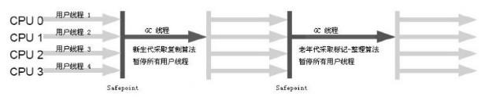

在讨论垃圾回收之前我们先来看看以下问题做好准备工作，并通过这些问题对垃圾回收过程进行详细的讲解。

我们首先来看看在java中，一个对象创建时候是如何进行内存空间分配的？

当虚拟机遇到new指令的时候，先去检查这个指令的参数是否能够在常量池中定位到一个符号的引用(类的全限定名)，在判断这个符号引用代表的类是否已经被加载，如果没有被加载，将会进行类的加载操作。通过加载检查后，将对类分配内存。
对象分配内存的方式：

- 指针碰撞。将所有的使用过的内存放在一侧，空闲的内存放在另一侧，中间放一个指针作为分界指示器，给对象分配内存的时候，就是将指针向空闲内存区域移动和对象大小相等的距离。

- 空闲列表。如果java堆空间不是规整的，使用过的空间和空闲的空间进行交错，这时就不能够使用指针碰撞进行内存空间的分配，此时需要维护一个列表，用于记录空间中那些内存空间是可用的，当需要分配内存空间的时候，在空闲列表中寻找一个足够大的空间分配给对象，并更新列表中的记录。                                                                                                                                        

  所以在后面讲到事物垃圾回收器中，采用标记整理算法和复制算法的收集器采用的就是指针碰撞方式进行内存的分配，而使用标记清除算法的收集器采用的是空闲列表的方式进行对象空间的分配。

分配内存的过程并非是线程安全的，解决方案：1、失败重试，2、为每个线程分配本地线程缓冲区(TLAB)，当TLAB使用完之后分配新的TLAB的时候，实行同步锁定。分配结束后，将分配的内存除对象头外，其余初始化为0值。如果使用TLAB，则初始化为0值提前到TLAB分配时执行。

要进行垃圾回收，那如何判断一个对象是否应该被回收？

* 引用计数算法：每当有一个地方引用他，就加1，引用失效，就减1.数量为0，说明可以进行回收。引用计数算法的缺点就是无法判断两个对象之间存在相互引用的情况。jvm中没有使用这种判断方式。
* 可达性分析算法：通过一系列GCRoot对象作为起始点，从这些点开始向下搜索，搜索的路径成为引用链，当一个对象到GC没有任何引用链，说明对象可以被回收。

那哪些对象可以作为GCRoot对象？

* 虚拟机栈的栈帧中引用的对象。
* 方法区中静态属性引用的对象。
* 方法区中常亮引用的对象。
* 本地方法栈中jni引用的对象。

在下面我们将会讲到，当进行GC垃圾回收的时候，由于不能够出现引用关系还在不断进行变化，所有用户的线程将会被停止，所以在停止用户线程的时候，如果使用GCRoot枚举根节点一个不漏的检查完全局引用位置，必定非常耗费时间，这种情况应当如何进行解决？

枚举根节点时候需要GC停顿，保证分析结果的准确性。执行准确式GC并不需要检查执行上下文中所有的引用的位置，在Hotspor中通过OopMap的数据结构来达到这个目的。在类加载完成的时候，虚拟机会将对象内什么偏移量什么数据计算出来，在JIT编译的时候，会在特定的位置记住栈和寄存器中什么地方存在引用（这些位置都是在特定的指令之后进行记录），GC直接对这些引用进行扫描。

在OopMap帮助下，HotSpot可以快速的完成准确式的GC，但是由于指令非常多，如果每条指令都记录OOPMap将会导致需要大量的额外空间，所以在实际中，HotSpot并没有为每个指令生成OopMap，而是在特定的位置记录了这些信息，这些特定的位置称之为安全点，所以程序不是在任何时候都能够进行GC，只有到达安全点才能进行GC。

既然只能选定特定的位置作为安全点，那么安全点应该如何选定？

安全点是依据是否能够让程序长时间的运行为特点进行选定，由于每条指令的运行时间都十分短，所以一般选用的点为方法的调用，循环跳转，异常跳转等时间稍长的指令作为安全点。

下文将会讲到，当发生GC的时候，必须使得所有的用户线程都停顿下来，那如何让线程在发生GC时候跑到最近的安全点停顿下来？

有两种方法可以实现：

* 抢先式中断：发生GC时中断所有的线程，如果发现某条线程不在安全点，就恢复此线程让他跑到安全点上。(虚拟机一般不使用)。
* 主动式中断：不对线程进行操作。设置一个标志位，让所有的线程去轮询标志位，发现标志位为真，就自动挂起。轮询标志的地方和安全点是重合的，再加上创建对象需要分配内存的地方。

安全点看似解决了GC问题，但是随之新的问题又出现了。当发生GC的时候线程处于sleep状态，此时线程无法响应中断请求，也就是线程不能够跑到轮寻标志的位置进行挂起。那此时应该怎么办？这时就需要使用安全区域进行解决。安全区域就是代码片段中引用关系不会发生变化的地方。当线程执行到安全区域的时候，会对线程进行标记，发生GC时候，jvm不管这些线程，在GC的时候，如果这些线程要离开安全区域，此时，判断jvm是否已经完成GC，如果完成，则线程执行，如果没有完成，则线程停顿等待GC完成的信号。（当线程发生sleep时正处于安全区域）

通过可达性算法，我们知道那些对象能够被回收，那些对象不能够被回收，那是否可达性算法不可达的对象就一定会被回收？答案是不一定，垃圾回收过程步骤如下：

* 当发现对象不可达的时候，将会对此对象进行第一次标记，对标记的对象就行筛选，筛选的条件是是否有必要执行finalize()方法。

* 当此对象已经调用过finalize()方法或者在对象中没有覆盖finalize()方法，则判定次对象没有必要执行finalize()方法。

* 没有必要执行finalize()方法的对象将会直接被回收。

* 有必要执行finalize()方法的对象放在一个队列中，之后有虚拟机创建一个低优先级的线程去出发队列中的对象的finalize()方法，注意此处为触发并非等待finalize()执行结束，防止finalize()方法中出现死循环导致回收系统崩溃。

* 当一个对象的finalize()方法执行结束后，方法并没有被回收，稍后会对队列中的对象进行二次标记，此时标记的依据是对象是否可达。如果还是不可达，才会将此对象放入即将回收的集合。所以finalize()方法中如果为对象添加引用链，可以拯救此对象。

  注意：每个对象的finalize()方法只会被jvm调用一次，如果一个对象在第一次执行finalize()时候被拯救，在下次执行回收会直接对对象就行回收，将不会调用对象的finalize()方法。

以上所说的垃圾回收都是对堆区中的对象进行回收，那方法区中没有垃圾回收？

有垃圾回收，但是回收的效率低。
方法区只要回收废弃的常量和无用的类。
如果没有任何地方对此常量进行引用，则此常量就会被回收。

方法去中所谓的回收无用的类，那什么样的类会被判定为无用的类？

* java堆中不存在该类的任何实例。	

* 加载该类的ClassLoader已经被回收。

* 该类的class对象没有任何地方被引用。

  满足以上三个条件的类可以被回收，而不是和java堆中的对象一样必然会被回收。

我们再来看看你java中的引用的类型，虽然和讲解垃圾回收关系不大，但是能够帮助你更好的理解垃圾回收的对象。

* 强引用：通过new创建出来的对象。只要强引用存在，垃圾回收器将不会回收。
* 软引用：通过SoftReference实现软引用，系统将要发生内存溢出之前才会对这些对象进行回收。
* 弱引用：通过WeakReference实现弱引用，无论当内存是否足够，GC运行时都会进行回收。
* 虚引用：通过PhantomReference实现，通过虚引用无法回去对象的实例，虚引用的作用就是当此对象被回收时，会收到一个系统通知。

接下来就正式对垃圾回收进行讲解，首先垃圾收集器是如何对堆内存进行划分的呢？

一般将堆内存分为新生代和老年代，新生代又分为一块较大的Eden和两块较小的Survivor区域(HotSpot虚拟机E:S=8:1)。
新生的对象优先分配在新生代的E区，如果启用本地线程缓冲，优先在TLAB上进行分配，少数情况也会直接在老年代进行对象的分配，在以下几种情况下，对象会转入老年代。

* 当在E分配对象发现内存不够使用的时候，会发生新生代的GC将E区对象转入S区，当发现S区无法存放时，通过分配担保将对象转入老年代。
* 大对象直接进入老年代(阀值可以通过参数进行设定)，为了避免E区和S区之间发生大量的内存复制。
* 长期存活的对象进入老年代，虚拟机给每个对象定义了一个年龄计数器，在E区中的对象经过一次GC仍然存活并能够被S区容纳，设置此对象的年龄为1，在S区中的对象，每熬过一次GC，就将年龄加1，当年龄达到一定的程度(默认是15，可以通过参数进行设置)就会进入老年代。
* 动态年龄判断，不一定只有年龄达到阀值才会进入老年代，当相同年龄的对象的总大小大于S空间的一半，则大于等于这个年龄的对象将会进入老年代。

上面讲到，当发现S区无法存放时，通过分配担保将对象转入老年代。那什么是空间分配担保？

当新生代发生GC的时候，先判断老年代中的剩余空间的总大小是否大于新生代中的总对象的大小，如果是，则发生进行新生代的GC，如果不是，则判断是否允许担保失败（可以通过HandlePromotionFailure进行设置），如果不允许，则进行老年代的GC,如果允许，则判断老年代中的剩余空间的总大小是否大于新生代每次发生GC时进入老年代的对象的平均值，如果是，则进行新生代的GC，如果不是，则进行一次老年代的GC。在担保失败的情况下会进行FULL GC，如果担保失败，判断平均值使得多了一次计算，但是计算均值担保是有必要的，他可以是为了防止进行频繁的老年代GC。

垃圾回收器都是在不同垃圾回收场景使用合理的垃圾回收算算法进行实现的。具体垃圾回收算法有以下几种。

* 标记-清除：标记所有需要被回收的对象，然后回收。次算法效率低，并且产生内存碎片，由于老年代中存活的对象多，在老年代中进行使用。

* 复制算法：将内存划分为等大小的两块，每次使用其中的一块，回收时，将存活的对象复制到没有使用的一块内存中，然后对使用的内存一次性就行清理。

  实现简单，运行高效，但是存在大量内存的浪费。由于新生代中存活的对象少，新生代中使用这种算法将E区存活的对象复制到S区。

* 标记整理算法：让所有存活的对象往一侧移动，然后清楚另一侧。老年代中使用这种算法，避免产生内存碎片。

最后谈谈java中的垃圾回收器的实现及其使用场景。

* Serial收集器
  属于单线程垃圾收集器，在进行垃圾收集的时候，必须停止其他所有的用户正常工作线程。这对很多的应用来说都是难以接受的。从jdk1.3-1.7,hotspot虚拟机开发团队一直致力于开发能够消除或者减少用户线程停顿的收集器，至今优秀的收集器不断出现，用户线程停顿的时间不断缩短，但是仍不能够进行消除。

  在实际的开发中，Serial依然是虚拟机运行在Client模式下的默认的新生代收集器。在于单个CPU的环境下，Serial收集器由于没有线程交互的开销，可以获得最高的垃圾收集效率。并且在用户桌面应用场景中，由于分配给虚拟机管理的内存一般不会太大，所以垃圾收集的停顿时间完全可以控制在一百多毫秒以内，只要垃圾手机不过于频繁，对用户来说是可以接受的。

* Serial old收集器

  serial old是serial的老年代版本，同样是一个单线程的收集器，采用的是标记整理算法，此收集器的主要意义是给在client模式下的虚拟机使用。

  在server中，他的用途为：在jdk1.5之前和parallel scavenge收集器搭配使用。二是作为Cms收集器的后备方案，在并发收集器发生Concurrent Mode Failure时候使用。

  ​

  

* ParNew收集器

  parNew是Serial收集器的多线程版本，parnew除了采用多线程之外，其余的和serial没有太大的区别，他是运行在server模式下的首选新生代垃圾收集器，其中一个和性能无关的原因是目前除了parnew，只有serial能配合cms工作。

  在单核CPU下，Serial的性能是超过parnew的，但是CPU数量大于等于二的情况下，parnew的效率必定超过serial。

  

* parallel scavenge收集器

  此收集器是一个新生代采用复制算法的并行多线程收集器。此收集器看上去和parnew收集器一样，但是他的关注点和其他收集器不同。

  CMS等其他收集器关注点是尽可能的减少垃圾收集过程中用户线程的停顿时间，而此收集器的目标是达到一个可控制的吞吐量。吞吐量=用户线程执行的时间/（用户线程执行时间+垃圾收集时间）。

  停顿时间短适合于用户进行交互的程序，使用好的响应速度提升用户的体验。而高的吞吐量可以高效的利用CPU，尽快的完成程序的计算，适合于后台运算而不需要太多的交互任务。

  parallel scavenge通过参数最大垃圾收集停顿时间参数-XX:MaxGCPauseMillis和设置吞吐量参数-XX:GCTimeRatio进行控制吞吐量。

  MaxGCPauseMillis参数是一个大于0的毫秒值，收集器保证垃圾收集时间不会超过这个时间值，但是不要以为将这个值设置的尽可能小就能够垃圾回收速度加快，因为停顿时间的缩短是通过牺牲吞吐量和新生代的空间换来的，缩短时间会导致垃圾收集的次数更频繁。

  GCTimeRatio是一个大于0小于100的整数，就是垃圾收集时间占总是间的比率，相当于吞吐量的倒数。此数值设置的越大，表示吞吐量越大。

* parallel old收集器

  parallel old是parallel scavenge收集器的老年代版本，使用多线程和标记整理算法。此收集器是在jdk1.6中开始提供。在此之前，如果新生代使用parallel scavenge收集器，老年代除了使用serial old收集器别无选择，由于serial old在服务器端性能上的拖累使得parallel scavenge无法获得吞吐量最大化效果。

  parallel old出现后吞吐量优先才有了名副其实的组合，所以在注重吞吐量和CPU资源敏感的场合中优先考虑parallel old和parallel scavenge的搭配使用。

  

* CMS收集器

  以获得最短停顿时间为目标，基于标记清除算法，是server模式下提高用户请求响应速度，给用户带来良好体验的不错选择。

  他的运作过程分为4个步骤：

  初始标记：需要停止用户线程，初始标记只是标记一下GC Root能够直接关联到的对象，速度很快。

  并发标记：进行遍历GC Root关联的对象，此过程可以和用户线程并行。

  重新标记：修正并发比标记期间因用户线程继续执行而产生的变动，此过程需要停止用户的线程，并且此过程停顿的时间比初始标记停顿的时间稍长，但是小于并发标记所需要的时间。

  并发清除：清除线程和用户线程并行

  由于整个过程中耗时最长的并发标记和并发清除过程都可以和用户线程并行，所以总体上可以说垃圾收集过程和用户的线程是并行的。

  CMS属于低停顿，但是并不是完美的，缺点如下：

  * CMS收集器对CPU的资源非常的敏感。

    在和用户线程并行执行的阶段，虽然不会停止用户的线程，但是或占用cpu的资源，导致用户线程的执行速度变慢，总体的吞吐量降低。CMS默认启动的回收线程的数量是（CPU数量 + 3）/4，占用CPU的资源=垃圾收集线程数量/CPU数量，不难计算出占CPU资源=（1/4 + 3/（4 × CPU数量））（此为估计值），所以回收线程占用CPU的资源至少为25%，随着CPU数量的增加而减少。并且当CPU的数量为2时，占用CPU的资源为50%，这时无法接受的。

    为了解决这种问题，虚拟机提供了一种增量式并发收集器，这种收集方式采用的就是和单CPU执行抢占CPU资源的思想：在并发标记，清理的时候，让GC线程和用户线程交替执行，尽量减少GC线程占用CPU的时间，这样使得垃圾收集的总是间变得更长。但是实践证明，这种方式效果一般，在目前的版本中已经不提倡使用。

  * CMS收集器无法收集浮动垃圾，并且在收集过程中如果提供给用户线程使用的空间不够用将会导致FULL GC。

    由于CMS进行并发清理的时候，用户线程同时也在运行，此时还会产生新的垃圾，这一部分垃圾发生在并发标记之后，CMS无法对其进行回收，需要留到下次GC时进行回收。也是由于垃圾收集阶段，用户线程需要运行，所以CMS收集器不能和其他垃圾收集器一样等到老年代被完全填满之后才进行收集，而是需要预留一部分空间给垃圾回收过程中的用户线程进行使用。在jdk1.5中，CMS收集器当老年代被使用超过68%时被激活，如果老年代中垃圾增长速度不是太快，可以适当将此值调高（-XX:CMSInitiatingOccupancyFraction），从而降低垃圾回收的次数来提高性能。在jdk1.6中，启动阀值提升至92%。

    如果CMS运行期间预留的内存无法满足用户程序需要，会出现“Concurrent Mode Failure”失败，此时虚拟机将会启动后备方案：临时启用Serial Old收集器重新进行老年代垃圾的回收，这样使得GC停顿的时间变得很长，反而减低了性能。

  * CMS是基于标记清除算法实现，在垃圾收集的过程中会产生大量空间碎片。

    空间碎片的过多将会导致老年代即时有很大的空间但是无法找到足够大的连续的空间来分配对象，从而导致FULL GC，为了解决这个问题，CMS收集器提供参数-XX:+UseCMSCompactAtFullCollection开关参数（默认开启），用于当CMS收集器顶不住要进行FullGc时开启内存碎片的整合过程，整合过程是无法和用户线程进行并行的，内存碎片问题得到了解决，但是停顿时间不得不变长。另外提供参数-XX:CMSFullGCsBeforeCompaction，用于设置执行多少次不压缩的Full GC之后执行一次压缩，默认值为0。

    

* G1收集器​

  是一款面向服务端的垃圾收集器，与其他收集相比他主要有以下特点：

  * 并发与并行：G1充分利用多CPU，多核环境下额硬件优势，使用多个CPU来缩短GC停顿时间，部分其他CPU原本需要停顿用户线程执行GC动作，G1收集器仍然可以和用户线程并行执行。
  * 分代收集：G1收集器仍保留了分代收集的概念，并且不与其他收集器配合的情况下也能够完成整个GC堆的收集和整理。但是G1收集器也可以采用不同的方式去处理新创建的对象，已经存活一段时间的对象，熬过多少次GC的对象以获取更好的收集效果。
  * 空间整合：G1整体采用标记整理算法实现，局部来看（两个Region之间）基于复制算法实现，两个算法在垃圾收集过程中不会产生内存碎片，不会有频繁的Full GC出现。
  * 可预测停顿：降低停顿时间是CMS和G1的共同关注点，但是G1追求低停顿同时还建立了停顿时间模型，能够让使用者明确指定在一个长度为M的时间片段，消耗在垃圾收集上的时间不能超过N秒。

  在G1之前的所有收集器，都是针对整个新生代和老年代。而使用G1收集器时，java堆的内存布局与其他收集器明显不同，他整个java堆规划为多个大小相等的独立区域（Region），虽保留新生代和老年代的概念，但是新生代和老年代不再是物理隔离的，他们都是一部分不连续的Region的集合。

  G1能够建立可预测的时间停顿模型的原因就是它能够有计划的避免在整个java堆进行垃圾收集。G1能够跟踪各个Region里面的垃圾堆积的价值大小（回收所需要的时间，回收所能够获得空间的大小），在后台维护一个优先列表，在每次垃圾收集时，根据允许的收集时间，优先回收价值最大的Region。这种方式保证了在有限的时间内获取尽可能高的收集效率。

  G1把内存化整为零实践过程中的问题：Region不可能是孤立存在的。一个对象分配在某个Region中，他可以被整个java堆中的任意对象引用，所以在做可达性算法进行判断对象是否存活的时候，需要进行整个java堆扫面才能够保证垃圾回收的准确定。这个问题在其他收集器中也有，只是在G1中表现的更为突出。在之前的垃圾回收器中，新生代的规模一般比老年代小很多，新生代的收集也比老年代频繁很多，那时回收新生代的时候也面临着同样的问题——在回收新生代的时候不得不扫面老年代。那收集器是怎样对这种问题进行解决的呢。

  在G1收集器中Region之间的对象引用问题以及其他收集器中新生代和老年代之间的对象引用问题，虚拟机都是使用Remembered Set来避免进行全堆进行扫描的。G1中的每个Region都有一个与之对应的Remembered Set，当虚拟机发现程序对Reference类型的数据进行写操作的时候，会产生一个Write Barrier暂时中断写操作，检查Reference是否处于不同的Region之中（在分代的收集器中就检查是否存在老年代引用了新生代的对象），如果是，就通过CardTable把相关的引用信息记录到被引用对象所属的Region的Remembered Set中。在进行垃圾回收的时候，在GC根节点的枚举范围中加入Remembered Set就可以保证不进行全堆进行扫面。

  G1收集器垃圾回收步骤：

  * 初始标记：仅仅是标记一下GC Root能够直接关联到的对象，并且修改TAMS(Next Top at Mark Start)的值，让下一阶段用户程序在并发运行时，能在正确可用的Region中创建对象，此阶段需要停顿用户线程，但是停顿时间短。

  * 并发标记：此阶段是通过GC Root引用判断对象是否存活，用时较长，但是和用户线程并发执行。

  * 最终标记：标记并发标记阶段用户线程运行时候产生的对象变动，在并发标记阶段，虚拟机将对象的变动记录在线程Remembered Set Logs中，最终标记阶段将Remembered Set Logs中的数据合并到Remembered Set中，这阶段需要停止用户线程，但是标记线程可以并行执行。

  * 筛选回收：先对各个Region的回收价值进行排序，根据用户期望的停顿时间制定回收计划，这阶段可以做到和用户线程并行执行，但是由于只是收集部分区域，并且时间由用户可控，所以这阶段选择停止用户线程，让多个垃圾收集线程并行执行，提高垃圾回收的效率。

    

