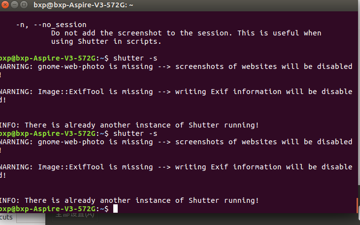

**提交**：git commit -m "add distributed"
**查看状态**：git status
**查看修改**：git diff
**提交日志**：git log
**返回上一个版本**：git reset --hard HEAD^。
**返回到具体版本**：git reset --hard 3628164（版本号没必要写全，前几位就可以）
**查看之前使用过的命令**：git reflog
**撤销修改（工作区）**：git checkout -- readme.txt意思就是，把readme.txt文件在工作区的修改全部撤销，这里有两种情况：

  一种是readme.txt自修改后还没有被放到暂存区，现在，撤销修改就回到和版本库一模一样的状态；
  一种是readme.txt已经添加到暂存区后，又作了修改，现在，撤销修改就回到添加到暂存区后的状态。
总之，就是让这个文件回到最近一次git commit或git add时的状态。

	git checkout -- file命令中的--很重要，没有--，就变成了“切换到另一个分支”的命令
**撤销修改（缓存区）**：git reset HEAD file可以把暂存区的修改撤销掉（unstage），重新放回工作区
git reset命令既可以回退版本，也可以把暂存区的修改回退到工作区。当我们用HEAD时，表示最新的版本。
**文件的删除**：
	rm test.txt
	这个时候，Git知道你删除了文件，因此，工作区和版本库就不一致了，git status命令会立刻告诉你哪些文件被删除了
	现在你有两个选择，一是确实要从版本库中删除该文件，那就用命令git rm删掉，并且git commit：
	另一种情况是删错了，因为版本库里还有呢，所以可以很轻松地把误删的文件恢复到最新版本：
		git checkout -- test.txt
		git checkout其实是用版本库里的版本替换工作区的版本，无论工作区是修改还是删除，都可以“一键还原”。
远程仓库：
	第1步：创建SSH Key。在用户主目录下，看看有没有.ssh目录，如果有，再看看这个目录下有没有id_rsa和id_rsa.pub这两个文件，如果已经有了，可直接跳到下一步。如果没有，打开Shell（Windows下打开Git Bash），创建SSH Key：

$ ssh-keygen -t rsa -C "youremail@example.com"

你需要把邮件地址换成你自己的邮件地址，然后一路回车，使用默认值即可，由于这个Key也不是用于军事目的，所以也无需设置密码。

如果一切顺利的话，可以在用户主目录里找到.ssh目录，里面有id_rsa和id_rsa.pub两个文件，这两个就是SSH Key的秘钥对，id_rsa是私钥，不能泄露出去，id_rsa.pub是公钥，可以放心地告诉任何人。

	第2步：登陆GitHub，打开“Account settings”，“SSH Keys”页面：

	然后，点“Add SSH Key”，填上任意Title，在Key文本框里粘贴id_rsa.pub文件的内容：
	为什么GitHub需要SSH Key呢？因为GitHub需要识别出你推送的提交确实是你推送的，而不是别人冒充的，而Git支持SSH协议，所以，GitHub只要知道了你的公钥，就可以确认只有你自己才能推送。

当然，GitHub允许你添加多个Key。假定你有若干电脑，你一会儿在公司提交，一会儿在家里提交，只要把每台电脑的Key都添加到GitHub，就可以在每台电脑上往GitHub推送了。

最后友情提示，在GitHub上免费托管的Git仓库，任何人都可以看到喔（但只有你自己才能改）。所以，不要把敏感信息放进去

关联远程库：git remote add origin git@github.com:michaelliao/learngit.git
把本地库内容推送到远程：git push -u origin master
	把本地库的内容推送到远程，用git push命令，实际上是把当前分支master推送到远程。
	由于远程库是空的，我们第一次推送master分支时，加上了-u参数，Git不但会把本地的master分支内容推送的远程新的master分支，还会把本地的master分支和远程的master分支关联起来，在以后的推送或者拉取时就可以简化命令。
	从现在起，只要本地作了提交，就可以通过命令：
	
	 git push origin master

SSH警告
	当你第一次使用Git的clone或者push命令连接GitHub时，会得到一个警告：
	The authenticity of host 'github.com (xx.xx.xx.xx)' can't be established.
	RSA key fingerprint is xx.xx.xx.xx.xx.
	Are you sure you want to continue connecting (yes/no)?
	这是因为Git使用SSH连接，而SSH连接在第一次验证GitHub服务器的Key时，需要你确认GitHub的Key的指纹信息是否真的来自GitHub的服务器，输入yes回车即可。
	Git会输出一个警告，告诉你已经把GitHub的Key添加到本机的一个信任列表里了：
	Warning: Permanently added 'github.com' (RSA) to the list of known hosts.
	这个警告只会出现一次，后面的操作就不会有任何警告了。
	如果你实在担心有人冒充GitHub服务器，输入yes前可以对照GitHub的RSA Key的指纹信息是否与SSH连接给出的一致。

远程克隆：
登陆GitHub，创建一个新的仓库，名字叫gitskills：
我们勾选Initialize this repository with a README，这样GitHub会自动为我们创建一个README.md文件。创建完毕后，可以看到README.md文件：
 git clone git@github.com:michaelliao/gitskills.git
你也许还注意到，GitHub给出的地址不止一个，还可以用https://github.com/michaelliao/gitskills.git这样的地址。实际上，Git支持多种协议，默认的git://使用ssh，但也可以使用https等其他协议。
使用https除了速度慢以外，还有个最大的麻烦是每次推送都必须输入口令，但是在某些只开放http端口的公司内部就无法使用ssh协议而只能用https。

